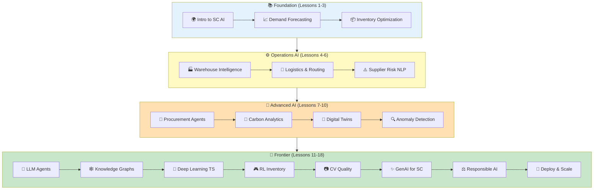

# 🎓 Supply Chain AI for Beginners

<p align="center">
  
  
  
  
  
</p>

> **19 Lessons — Master AI for Supply Chain Management, from fundamentals to production deployment**

<p align="center">
  <em>A comprehensive, free course by <a href="https://quantisage.com">Quantisage</a> — the AI Operating System for supply chains</em>
</p>

---

## 🌟 Why This Course?

Supply chains generate **80% of global emissions** and **60% of business costs**. AI is the most powerful lever to optimize both — but the talent gap is enormous. There are thousands of courses on AI/ML, but almost none that teach you how to apply these tools specifically to supply chain problems.

This course fills that gap. Built by a team with **20+ years of supply chain operations experience** and **deep AI/ML expertise**, every lesson connects theory to real operational decisions:

- 📦 **Should I reorder this SKU?** → Lesson 3 (Inventory Optimization)
- 🚚 **Which route minimizes cost AND carbon?** → Lesson 5 (Logistics AI)
- ⚠️ **Is this supplier about to fail?** → Lesson 6 (NLP Risk Monitoring)
- 🌿 **What's our Scope 3 footprint?** → Lesson 8 (Carbon Analytics)
- 🤖 **Can AI write my purchase orders?** → Lesson 7 (Procurement Agents)

---

## 🎯 Who Is This For?

| Role | What You'll Get |
|------|----------------|
| **Supply Chain Professionals** | Hands-on AI skills to transform your operations |
| **Data Scientists** | Domain knowledge to make your models impactful in SC |
| **Students** | Portfolio-ready projects in the hottest intersection of AI + industry |
| **Consultants** | Frameworks and code for client engagements |
| **Executives** | Understanding of what AI can (and can't) do for your supply chain |

---

## 📚 Curriculum

| # | Lesson | Topic | Notebook |
|---|--------|-------|----------|
| 00 | [🛠️ Course Setup](./00-course-setup/README.md) | Setting up your environment for supply chain AI development | [Open](./00-course-setup/notebook.ipynb) |
| 01 | [🌍 Introduction to AI in Supply Chain](./01-introduction-to-sc-ai/README.md) | Understanding how AI is transforming every link in the supply chain | [Open](./01-introduction-to-sc-ai/notebook.ipynb) |
| 02 | [📈 Demand Forecasting Fundamentals](./02-demand-forecasting-fundamentals/README.md) | Statistical and ML approaches to predicting customer demand | [Open](./02-demand-forecasting-fundamentals/notebook.ipynb) |
| 03 | [📦 Inventory Optimization with AI](./03-inventory-optimization-with-ai/README.md) | Using reinforcement learning and optimization for inventory decisions | [Open](./03-inventory-optimization-with-ai/notebook.ipynb) |
| 04 | [🏭 Warehouse Intelligence](./04-warehouse-intelligence/README.md) | Computer vision, robotics, and AI-driven warehouse operations | [Open](./04-warehouse-intelligence/notebook.ipynb) |
| 05 | [🚚 Logistics & Routing AI](./05-logistics-and-routing-ai/README.md) | Vehicle routing, fleet optimization, and transportation network design | [Open](./05-logistics-and-routing-ai/notebook.ipynb) |
| 06 | [⚠️ Supplier Risk with NLP](./06-supplier-risk-with-nlp/README.md) | Using NLP to monitor news, financials, and ESG signals for supplier risk | [Open](./06-supplier-risk-with-nlp/notebook.ipynb) |
| 07 | [🤝 Procurement AI Agents](./07-procurement-ai-agents/README.md) | Building AI agents that automate sourcing, negotiation, and PO generation | [Open](./07-procurement-ai-agents/notebook.ipynb) |
| 08 | [🌿 Scope 3 Carbon Analytics](./08-scope3-carbon-analytics/README.md) | AI-powered carbon footprint measurement across the supply chain | [Open](./08-scope3-carbon-analytics/notebook.ipynb) |
| 09 | [🔮 Digital Twins for Supply Chain](./09-digital-twins-for-sc/README.md) | Building simulation models for what-if analysis and scenario planning | [Open](./09-digital-twins-for-sc/notebook.ipynb) |
| 10 | [🔍 Anomaly Detection in Supply Chain](./10-anomaly-detection-in-sc/README.md) | Detecting exceptions, fraud, and process deviations with ML | [Open](./10-anomaly-detection-in-sc/notebook.ipynb) |
| 11 | [🤖 LLM Agents for SC Planning](./11-llm-agents-for-planning/README.md) | Building GPT-powered planning assistants and copilots | [Open](./11-llm-agents-for-planning/notebook.ipynb) |
| 12 | [🕸️ Knowledge Graphs for SC](./12-knowledge-graphs-for-sc/README.md) | Graph-based intelligence for multi-tier supplier networks | [Open](./12-knowledge-graphs-for-sc/notebook.ipynb) |
| 13 | [🧠 Time Series Deep Learning](./13-time-series-deep-learning/README.md) | LSTM, Transformer, and N-BEATS for demand and lead time forecasting | [Open](./13-time-series-deep-learning/notebook.ipynb) |
| 14 | [🎮 RL for Inventory Management](./14-reinforcement-learning-inventory/README.md) | Training agents to make optimal replenishment decisions | [Open](./14-reinforcement-learning-inventory/notebook.ipynb) |
| 15 | [📷 Computer Vision for Quality](./15-computer-vision-quality/README.md) | Defect detection and quality inspection using deep learning | [Open](./15-computer-vision-quality/notebook.ipynb) |
| 16 | [✨ Generative AI for Supply Chain](./16-generative-ai-for-sc/README.md) | Using LLMs for document generation, analysis, and automation | [Open](./16-generative-ai-for-sc/notebook.ipynb) |
| 17 | [⚖️ Responsible AI in Supply Chain](./17-responsible-ai-in-sc/README.md) | Ethics, fairness, transparency, and governance in SC AI | [Open](./17-responsible-ai-in-sc/notebook.ipynb) |
| 18 | [🚀 Building Your SC AI Startup](./18-building-your-sc-ai-startup/README.md) | From prototype to production: deploying SC AI solutions at scale | [Open](./18-building-your-sc-ai-startup/notebook.ipynb) |


---

## 🏗️ Course Architecture



---

## 🚀 Getting Started

### Prerequisites

| Tool | Version | Installation |
|------|---------|-------------|
| Python | 3.9+ | [python.org](https://python.org) |
| Jupyter | Latest | `pip install jupyter` |
| Git | 2.0+ | [git-scm.com](https://git-scm.com) |

### Quick Start

```bash
# Clone the repo
git clone https://github.com/virbahu/supply-chain-ai-for-beginners.git
cd supply-chain-ai-for-beginners

# Create virtual environment
python -m venv .venv
source .venv/bin/activate  # Linux/Mac
# .venv\Scripts\activate   # Windows

# Install dependencies
pip install -r requirements.txt

# Launch Jupyter
jupyter notebook
```

### Each Lesson Contains

```
📁 XX-lesson-name/
├── 📄 README.md          # Lesson overview, learning objectives, key concepts
├── 📓 notebook.ipynb      # Interactive Jupyter notebook with code + explanations
├── 📄 solution.ipynb      # Exercise solutions
└── 📁 data/              # Sample datasets for the lesson
```

---

## 🌐 Learning Paths

### 🏃 Speed Track (Weekend Sprint) — 3 lessons
Lessons 1, 2, 3 → Get demand forecasting + inventory optimization working in a weekend

### 📊 Data Scientist Track — 8 lessons
Lessons 1-3, 6, 10, 11, 13, 14 → Deep ML/AI focus for SC applications

### 🏭 Operations Leader Track — 6 lessons
Lessons 1, 2, 4, 5, 8, 9 → Strategic AI applications for SC operations

### 🚀 Full Course — All 19 lessons
Complete curriculum for comprehensive SC AI mastery

---

## 🤝 Contributing

We love contributions! Here's how:

1. 🍴 Fork this repo
2. 🌿 Create a feature branch (`git checkout -b lesson/my-improvement`)
3. 📝 Make your changes
4. 🔀 Submit a Pull Request

See [CONTRIBUTING.md](CONTRIBUTING.md) for detailed guidelines.

---

## 🙏 Acknowledgments

This course structure is inspired by [Microsoft's Generative AI for Beginners](https://github.com/microsoft/generative-ai-for-beginners), adapted and expanded for the supply chain domain with original content, code, and datasets.


---

## 👤 Author

**Virbahu Jain** — Founder & CEO, [Quantisage](https://quantisage.com)

> Building the AI Operating System for Scope 3 emissions management and supply chain decarbonization.

| | |
|---|---|
| 🎓 **Education** | MBA, Kellogg School of Management, Northwestern University |
| 🏭 **Experience** | 20+ years across manufacturing, life sciences, energy & public sector |
| 🌍 **Scope** | Supply chain operations on five continents |

---

## ⭐ Star History

If you find this useful, please **⭐ star this repo** — it helps others discover it!

## 📄 License

MIT License — see [LICENSE](LICENSE) for details.

<p align="center">
  <sub>Part of the <b>Quantisage Open Source Initiative</b> | AI × Supply Chain × Climate</sub>
</p>
